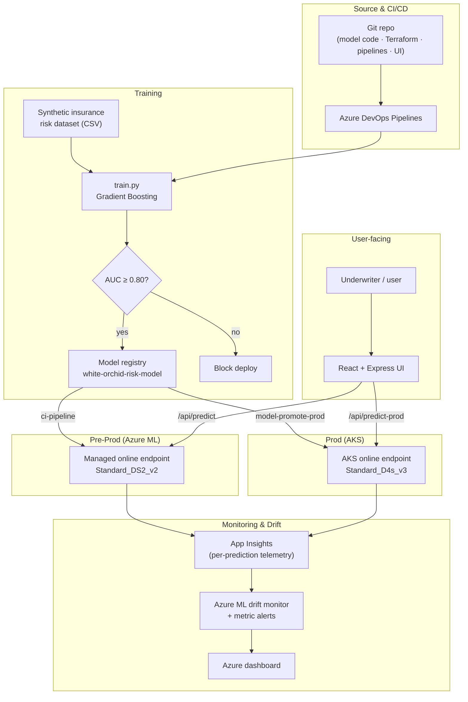
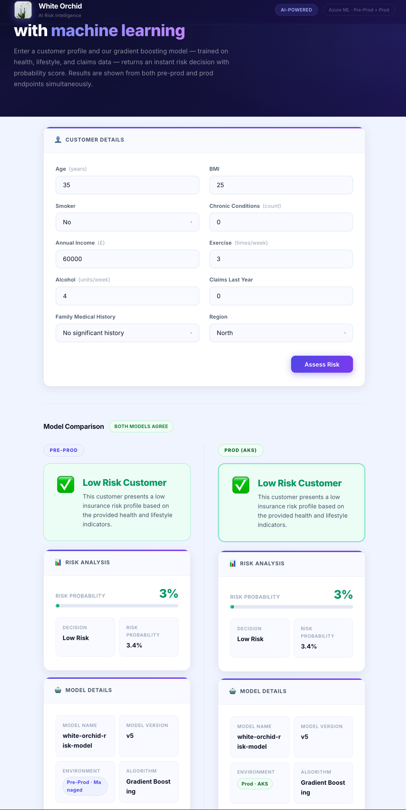

# White Orchid — Health Insurance Risk MLOps on Azure

An end-to-end **MLOps** project that trains, registers, deploys, and monitors a health
insurance **risk prediction** model on Azure — using Azure ML, AKS, and Azure DevOps.

Given a customer's health, lifestyle, and claims profile, the model predicts whether
they are a **high-risk** insurance customer (binary decision + probability).

## High-level overview

| Area | What it does |
|---|---|
| **Model** | Gradient Boosting classifier (sklearn) on a synthetic insurance dataset; quality gate of **AUC ≥ 0.80** blocks bad models from deploying. |
| **Pre-prod** | Azure ML workspace + **managed online endpoint** (Standard_DS2_v2). |
| **Prod** | Azure ML workspace + **AKS online endpoint** (Standard_D4s_v3, autoscaled). |
| **Pipelines** | Azure DevOps: train→deploy to pre-prod, promote to prod, deploy UI. |
| **Monitoring** | App Insights telemetry per prediction, Azure ML drift monitors, metric alerts, Azure dashboard. |
| **UI** | React + Express app that calls **both** endpoints and compares results side-by-side. |

## Architecture & flow



## Prediction flow (UI)

On form submit, the UI calls both endpoints in parallel (`Promise.allSettled`):

- **Both respond** → side-by-side `ModelComparison` (highlights disagreement = drift signal).
- **Only pre-prod responds** → single `RiskResult` (prod not yet deployed).



## Repo layout

```
infra/              Pre-prod Azure ML workspace + managed endpoint + App Service (UI)
infra-prod/         Prod AKS + Azure ML workspace + drift monitoring + dashboard
machinelearning/    Model code (train.py, score.py), conda envs, training job, sample data
pipelines/          Azure DevOps pipeline YAMLs
src/                Node.js/React UI (calls pre-prod + prod endpoints)
```

## Environments

| | Pre-prod | Prod |
|---|---|---|
| Endpoint | `ep-white-orchid-8bx7s6` (managed) | `ep-prod-white-orchid` (AKS) |
| Compute | Standard_DS2_v2 | AKS Standard_D4s_v3 |
| Pipeline | `ci-pipeline.yml` | `model-promote-prod-pipeline.yml` |

Azure region: `swedencentral`. See [`CLAUDE.md`](CLAUDE.md) for full details, and
[`GenAI.md`](GenAI.md) for GenAI/LLM extension ideas.
